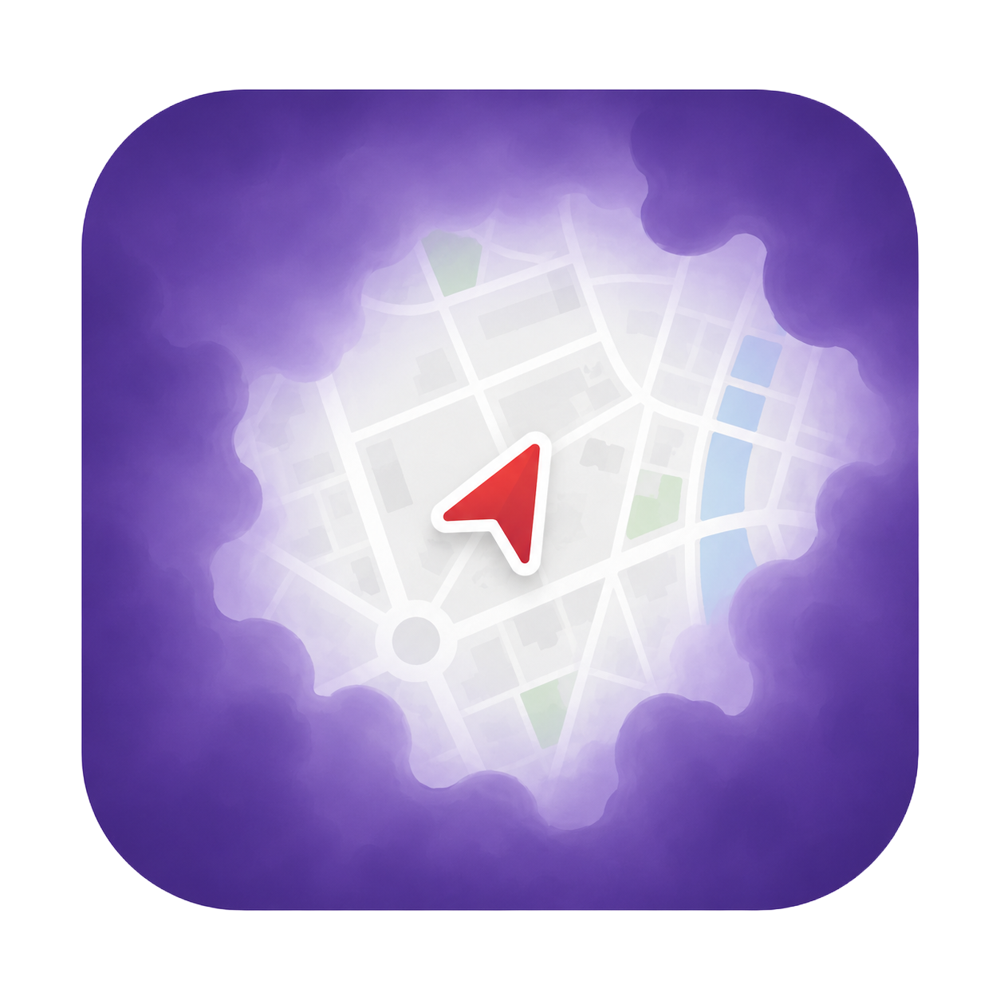

<p align="center">
  
</p>

<h1 align="center">Explorience</h1>

<p align="center">
  <b>Turn the world into your playground.</b><br />
  A multiplayer, location-based exploration game that transforms real-world geography<br />
  into a <em>Fog of War</em> map — discover, explore, and unlock landmarks as you move.
</p>

<p align="center">
  
  
  
  
  
  
</p>

---

## What is Explorience?

Explorience gamifies physical exploration. As you walk through a city, the map around you is shrouded in fog — your movement clears it, revealing the world. Unique landmarks and points of interest are locked behind proximity checks and AI-powered visual verification, turning every walk into an adventure.

### Core Mechanics

- **Fog of War** — The map starts hidden. Your movement clears the fog in real-time, grid cell by grid cell.
- **Discovery Engine** — GPS coordinates are discretized into spatial keys and batched to the server, so your exploration is persisted efficiently.
- **Gatekeeper Engine** — Landmarks require you to physically be nearby *and* snap a photo. An AI vision agent verifies your shot matches the landmark.
- **Multiplayer Sessions** — Play solo or invite friends to shared game sessions. Explore together, compete, or cooperate.

---

## Tech Stack

| Layer | Technology |
|---|---|
| **Framework** | Expo SDK 56 + React Native 0.85 |
| **Navigation** | Expo Router (file-based routing) |
| **Language** | TypeScript (strict mode) |
| **Styling** | NativeWind v5 + Tailwind CSS v4 |
| **Maps** | Mapbox (`@rnmapbox/maps`) |
| **Backend** | Supabase (Auth, Postgres, Realtime, Edge Functions) |
| **AI Vision** | Gemini 2.5 Flash (via Supabase Edge Functions) |
| **Animations** | React Native Reanimated |
| **Icons** | Lucide React Native |
| **Fonts** | Anton + Plus Jakarta Sans (Google Fonts) |
| **Platforms** | Android, iOS, Web |

---

## Project Structure

```
explorience/
├── mobile/                     # Expo app (client)
│   ├── app/                    # Expo Router screens
│   │   ├── (tabs)/             # Tab-based navigation
│   │   ├── _layout.tsx         # Root layout
│   │   └── ...
│   ├── components/             # Shared components & hooks
│   ├── constants/              # Theme, config, fog colors
│   ├── lib/                    # Supabase client init
│   ├── assets/                 # Fonts, images, fog textures
│   └── supabase/migrations/    # SQL migration files
├── seeder/                     # POI data pipeline & seeder
│   ├── pipeline/               # Filtering & ranking pipeline
│   ├── scripts/                # Seed scripts
│   └── output/                 # Generated city data
├── SPEC.md                     # Product specification
└── AGENTS.md                   # AI agent development guide
```

---

## Getting Started

### Prerequisites

- Node.js 18+
- npm
- An Android emulator or iOS simulator (or physical device with Expo Go)
- A Supabase project with the required schema

### Setup

```bash
# Clone the repo
git clone git@github.com:emrkkya1/explorience.git
cd explorience/mobile

# Install dependencies
npm install

# Start the dev server
npx expo start

# Run on Android
npx expo run:android

# Run on iOS
npx expo run:ios

# Run on Web
npm run web
```

---

## Architecture Philosophy

Explorience follows a **thick database / thin client** pattern:

- **Data correctness lives on the backend** — validation, cascade deletes, and business rules are enforced via Supabase RLS policies and Postgres constraints.
- **The client is a rendering engine** — it captures hardware inputs (GPS, camera) and displays state, nothing more.
- **Event-driven ledger tables** — grid discoveries and landmark unlocks are stored as independent chronological event rows, enabling Realtime WebSocket sync and clean auditing.

---

## License

This project is licensed under the [MIT License](./LICENSE).

---

<p align="center">
  <sub>Built with curiosity and a desire to explore.</sub>
</p>
